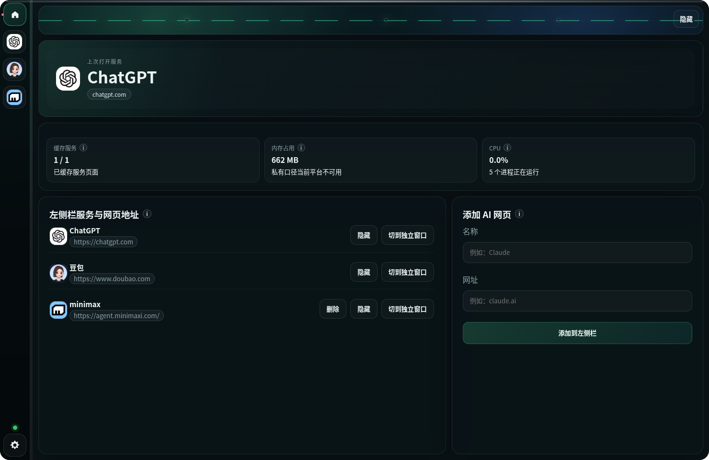
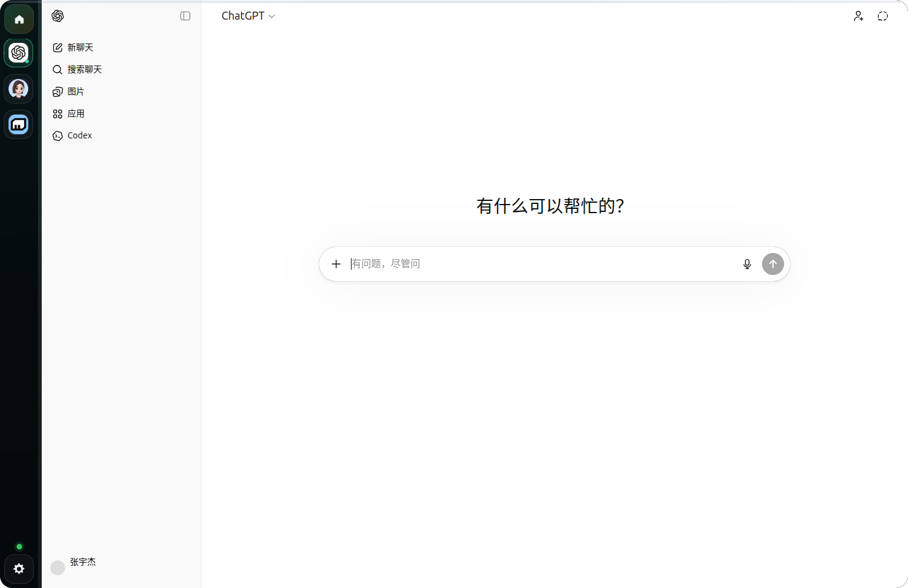
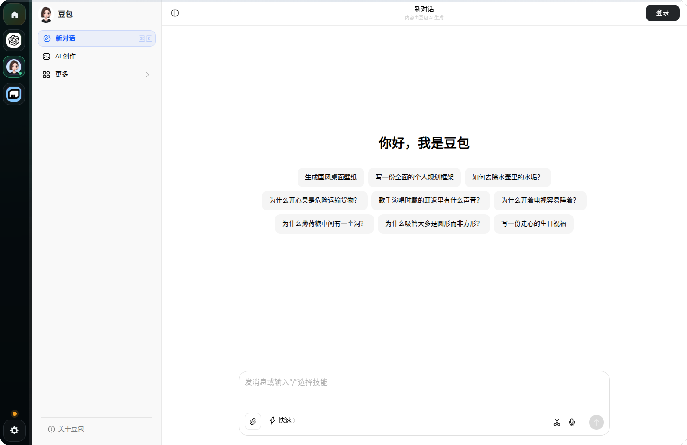
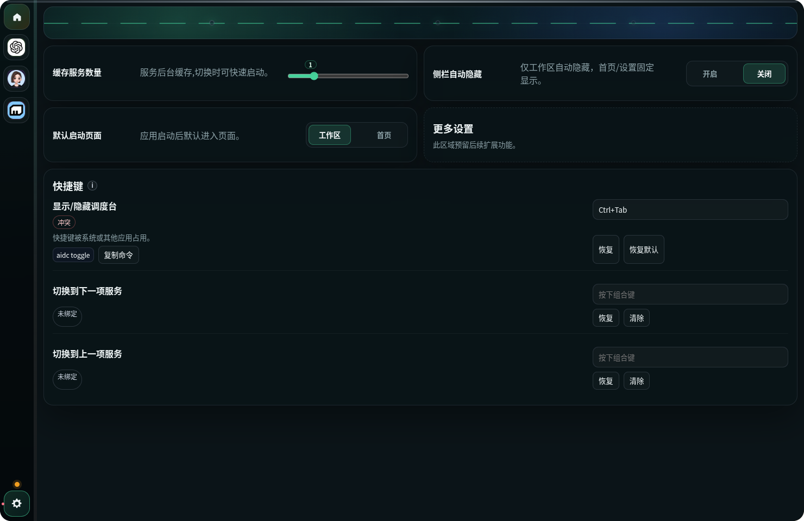

# AIProtal

AIProtal 是一个我自己日常在 Linux / Windows 上使用的桌面 AI 小工具，也分享给身边朋友一起用。
它把常用网页 AI 放进一个独立窗口里，方便通过托盘或快捷键随时打开、收起和切换。

## 功能概览

- 专用桌面窗口：与日常浏览器会话隔离，减少干扰
- 多服务聚合：内置 ChatGPT、豆包，并支持自定义 AI 网站
- 快捷键操作：默认 `Ctrl+Alt+Q`，并支持在设置页录制自定义组合键
- 侧栏与模式切换：支持侧栏显示/隐藏、内嵌模式与独立窗口回退
- 运行状态可观测：主页可查看窗口状态、内存与缓存信息

## 功能截图

### 首页



### 工作区（ChatGPT）



### 工作区（豆包）



### 设置页（快捷键录制）



## 这个小工具适合什么场景

- 你经常使用 ChatGPT、豆包这类网页 AI，但不想把它们淹没在浏览器标签页里
- 你希望 AI 是一个固定入口，需要时立刻打开，不用每次重新找页面、找窗口、找账号状态
- 你想要低学习成本的体验，安装后就能直接用，而不是先配置模型、API Key 或复杂规则
- 你需要一个独立的 AI 工作区，同时保留网页服务本身的能力与兼容性

## 和浏览器、Cherry Studio 的区别

- 浏览器更适合通用浏览，AIProtal 更适合把常用 AI 固定成一个专用入口
- 当标签页很多时，AI 页面很容易和搜索、文档、社交窗口混在一起，切换成本更高
- AIProtal 把“打开 AI”变成一个稳定动作：拉起、使用、收起，而不是反复找标签页
- Cherry Studio 更偏向多模型聚合、参数化调用和客户端能力整合,能力更强但是负载更大
- AIProtal 更偏向网页 AI 的轻量桌面入口体验，重点是快速进入、快速切换和减少打断
- 如果你要的是模型管理能力，Cherry Studio 更合适；如果你要的是常用 AI 的固定入口，AIProtal 更直接

## 设计灵感

项目交互思路灵感来自罗技 AI 调度台的“快速唤起、低打断、统一入口”理念，并结合 Linux / Windows 的桌面行为做了工程化落地。

## 下载安装

发布版本统一使用 GitHub Release，版本号格式为 `vX.Y.Z`（例如 `v1.0.0`）。

- 最新版本下载页：[Latest Release](https://github.com/20205917/ai-portal/releases/latest)
- 历史版本下载页：[Releases](https://github.com/20205917/ai-portal/releases)
- Linux `.deb` 直链模板（将 `<version>` 替换为版本号，如 `1.0.2`）：`https://github.com/20205917/ai-portal/releases/download/v<version>/AIProtal-<version>-linux-amd64.deb`
- Windows `.exe` 直链模板（将 `<version>` 替换为版本号，如 `1.0.2`）：`https://github.com/20205917/ai-portal/releases/download/v<version>/AIProtal-<version>-win-x64.exe`

### Linux (`.deb`) 安装

```bash
sudo dpkg -i AIProtal-<version>-linux-amd64.deb
# 若出现依赖问题
sudo apt-get -f install
```

### Windows (`.exe`) 安装

1. 双击 `AIProtal-<version>-win-x64.exe`
2. 按安装向导完成安装
3. 从开始菜单启动 `AIProtal`

## 最小使用路径

1. 启动应用
2. 使用托盘菜单或快捷键拉起调度台
3. 在左侧栏选择 AI 服务，或在首页添加自定义入口

可选：高级命令行控制（开发/自动化）：

```bash
aidc toggle
aidc open chatgpt
aidc status
```

如果本机 `aidc` 尚未加入 PATH，可使用：

```bash
node ./bin/aidc.mjs toggle
```

## 平台说明

- Linux：支持 Unix socket 命令通道；X11 下冲突时可回退 GNOME 系统快捷键
- Windows：支持 named pipe 命令通道与 NSIS 安装包

## 开发与维护文档

开发命令、测试矩阵、打包发布流程、回滚指南见：

- [AGENTS.md](AGENTS.md)
